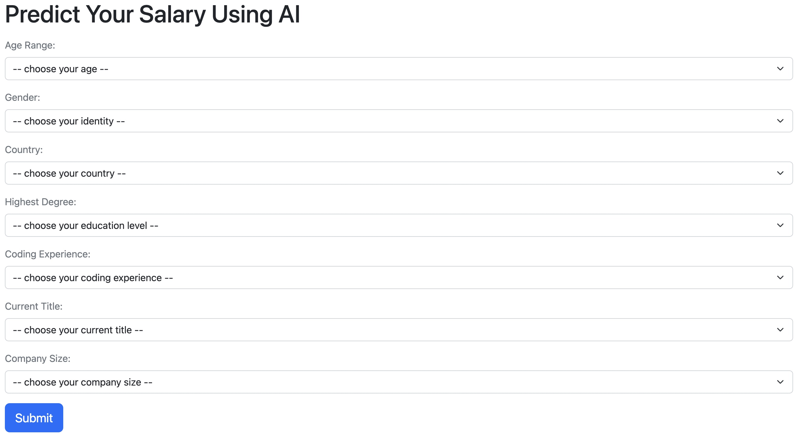
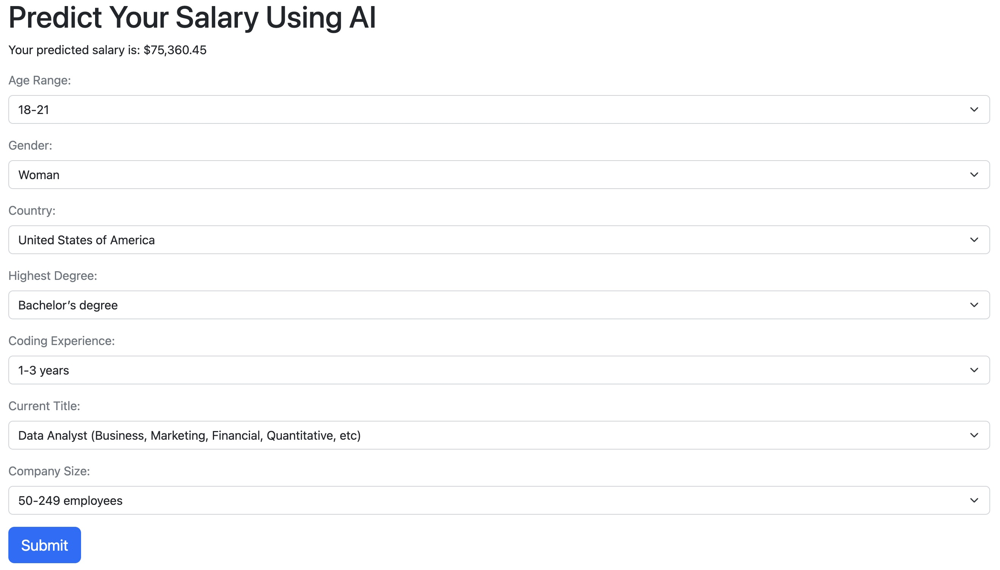

## Salary Prediction Model (Front End)

   

This application uses Python [Flask](https://flask.palletsprojects.com/en/3.0.x/) to provide a user interface for the salary prediciton machine learning model API.

---

### Instructions

1. Clone this repository to local computer

2. Create a new virtual environment

   - Mac: `python3 -m venv ./venv`
   - Windows: `python -m venv ./venv`

3. Activate the new virtual environment

   - Mac: `source ./venv/bin/activate`
   - Windows: `.\venv\Scripts\activate`

4. Install the dependencies `pip install -r requirements.txt`

5. Run the application with `flask run`

   a. To change the port: `flask run --port 8080`  
   b. To run in debug mode: `flask run --debug`

---

### Result

This is the result before you fill in your own criteria.

This is one example of a potential result after all criteria is filled in.
